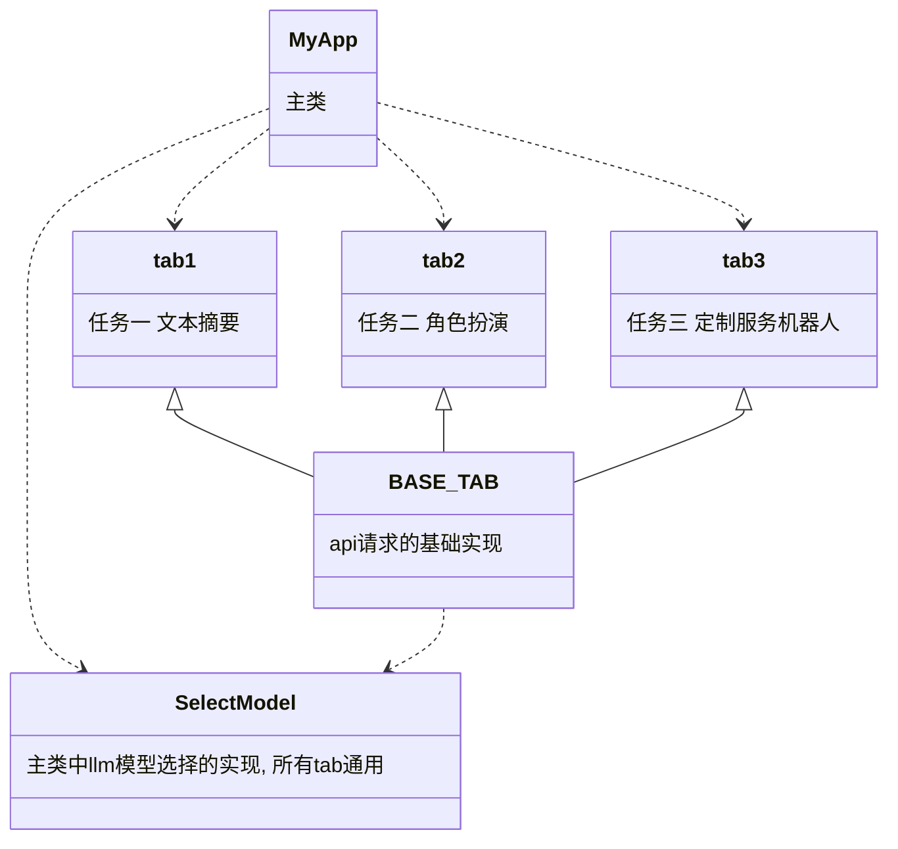
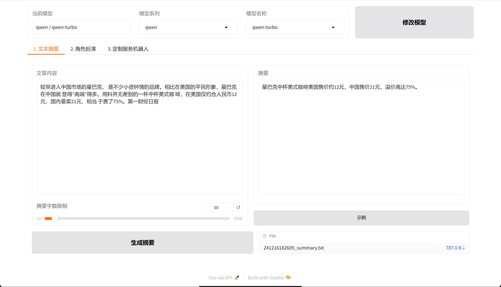
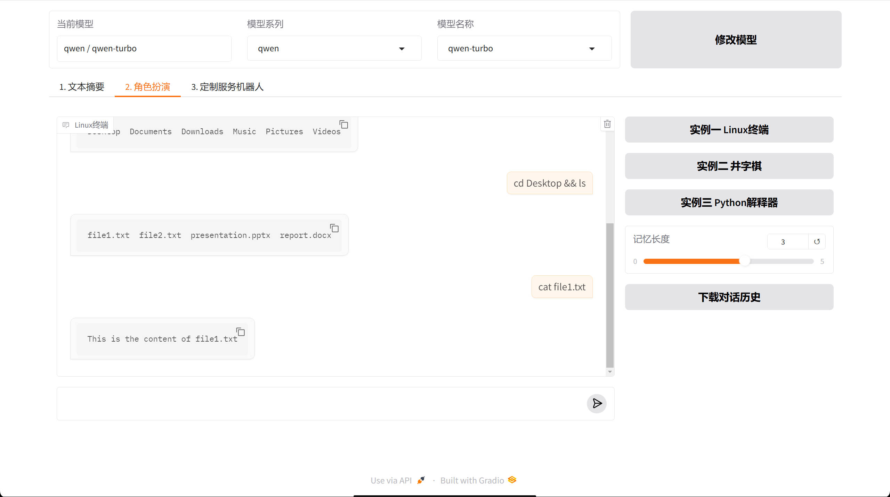

代码框架示意图：

```mermaid
classDiagram
	MyApp..<SelectModel
	MyApp..<tab1
	MyApp..<tab2
	MyApp..<tab3
	tab1<|--BASE_TAB
	tab2<|--BASE_TAB
	tab3<|--BASE_TAB
	BASE_TAB..<SelectModel
	MyApp: 主类
	tab1: 任务一 文本摘要
	tab2: 任务二 角色扮演
	tab3: 任务三 定制服务机器人
	BASE_TAB: api请求的基础实现
	SelectModel: 主类中llm模型选择的实现, 所有tab通用
```

任务一效果演示：

任务二效果演示：

